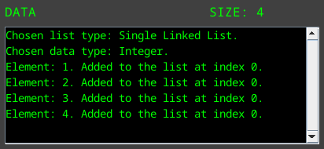

# Linked List Visualizer (VISLINK)

## Table of Contents
1. [About](#about)
2. [Features](#features)
3. [Usage](#usage)
4. [Build Instructions](#build-instructions)

## About
A side project i have been working on from time to time for some weeks. I mainly made this to get a greater understanding on how linked lists work and also to train myself in making a visualized program. Feel free to use and improve it if you want :). 

## Features
- Visualize linked lists such as:
    - Single linked lists.
        - 
    - Circular linked lists.
        - 
    - Double linked lists.
        - 
- Supports 4 datatypes:
    - String
        - 
    - Char
        - 
    - Integer
        - 
    - Double
        - 
- Use various functions to manipulate the visualized lists.
- Status window that shows recent actions.

## Usage
At first glance after start you will see a user interface akin to the image below:

As you can see there are many buttons and text field to choose from and manipulate in the control panel as visualized below:

The control panel is split between 5 sections.
- Sections:
    - [**SETUP**](#setup)
    - [**ADDITION**](#addition)
    - [**REMOVAL**](#removal)
    - [**UTILITY**](#utitily)
    - [**DATA**](#data)

Each section has its own "field of usage" wich is self-explanatory by their names.

#### SETUP
- **Fields**
    - **CHOSE LIST TYPE**: Choose which type of linked list to be visualized.
    - **CHOSE DATA TYPE**: Choose which type of data to be stored in the linked list.

#### ADDITION
- **Fields**
    - **TYPE ELEMENT**: The element to be added to the list.
    - **TYPE INDEX**: The index where the new element shall be inserted.
- **Buttons**
    - **ADD FIRST**: Adds the element in **TYPE ELEMENT** at the head of the list.
    - **ADD LAST**: Adds the element in **TYPE ELEMENT** at the tail of the list.
    - **ADD AT INDEX**: Add the element in **TYPE ELEMENT** at the index **TYPE INDEX**.

#### REMOVAL
- **Fields**
    - **TYPE ELEMENT**: The element to be removed from the list.
    - **TYPE INDEX**: The index where the present element shall be removed.
- **Buttons**
    - **REMOVE ELEMENT**: Removes the element in **TYPE ELEMENT** from the list.
    - **REMOVE FIRST**: Removes the head of the list.
    - **REMOVE LAST**: Removes the tail of the list.
    - **REMOVE AT INDEX**: Removes which ever element present at index **TYPE INDEX**.

#### UTILITY
- **Fields**
    - **TYPE INDEX 1**: Element present at index **TYPE INDEX 1** to be swapped with element at index **TYPE INDEX 2**.
    - **TYPE INDEX 2**: Self-explanatory.
    - **TYPE ELEMENT**: Element to be found.
- **Buttons**
    - **SWAP ELEMENTS**: Swaps the elements present at **TYPE INDEX 1** and **TYPE INDEX 2**.
    - **GET ELEMENT**: Checks if element is present in the list.
    - **SORT LIST**: Sorts the list.
        - 
        - 

#### DATA
- **Fields**
    - **DATA**: A small window that shows recent made actions and manipulations.
    - **SIZE**: Shows how big the list is at present time.
    - 

## Build instructions
1. **make build** to build the application
2. **make run** to start the application 
3. **make clean** to clean up the build directory (if desired)

## Requirements
- Java 11 or higher
- Gradle 6.0 or higher